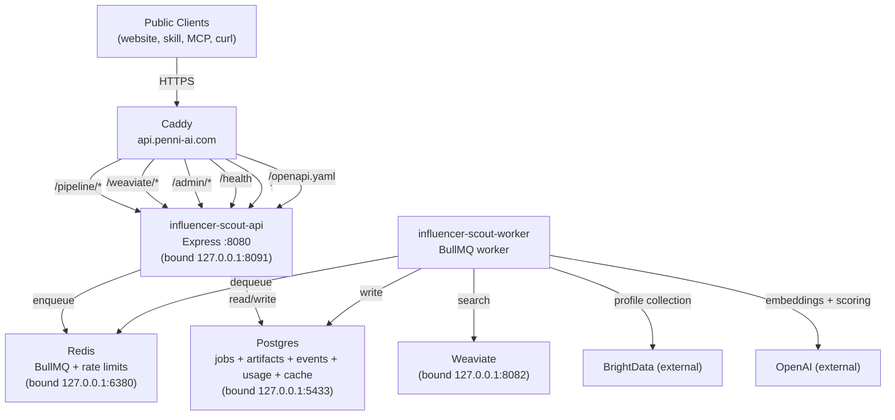
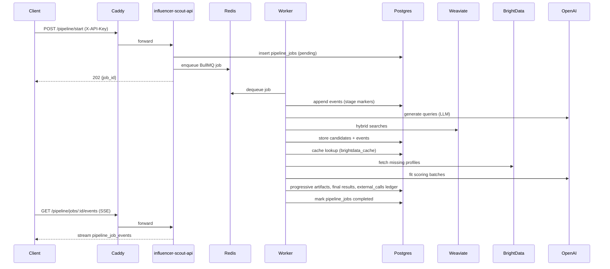

# Influencer Scout API Architecture Diagram (Hetzner-Only)

## High-Level Deployment (Production)

```mermaid
flowchart TB
  U["Public Clients\n(website, skill, MCP, curl)"] -->|HTTPS| C["Caddy\napi.penni-ai.com"]

  C -->|/pipeline/*| API["influencer-scout-api\nExpress :8080\n(bound 127.0.0.1:8091)"]
  C -->|/weaviate/*| API
  C -->|/admin/*| API
  C -->|/health| API
  C -->|/| API
  C -->|/openapi.yaml| API

  API -->|enqueue| R["Redis\nBullMQ + rate limits\n(bound 127.0.0.1:6380)"]
  W["influencer-scout-worker\nBullMQ worker"] -->|dequeue| R

  API -->|read/write| PG["Postgres\njobs + artifacts + events + usage + cache\n(bound 127.0.0.1:5433)"]
  W -->|write| PG

  W -->|search| WV["Weaviate\n(bound 127.0.0.1:8082)"]

  W -->|profile collection| BD["BrightData (external)"]
  W -->|embeddings + scoring| OAI["OpenAI (external)"]
```

## Pipeline Job Lifecycle (Data Flow)

```mermaid
sequenceDiagram
  participant Client
  participant Caddy
  participant API as influencer-scout-api
  participant Redis
  participant Worker
  participant Postgres
  participant Weaviate
  participant BrightData
  participant OpenAI

  Client->>Caddy: POST /pipeline/start (X-API-Key)
  Caddy->>API: forward
  API->>Postgres: insert pipeline_jobs (pending)
  API->>Redis: enqueue BullMQ job
  API-->>Client: 202 {job_id}

  Worker->>Redis: dequeue job
  Worker->>Postgres: append events (stage markers)
  Worker->>OpenAI: generate queries (LLM)
  Worker->>Weaviate: hybrid searches
  Worker->>Postgres: store candidates + events

  Worker->>Postgres: cache lookup (brightdata_cache)
  Worker->>BrightData: fetch missing profiles
  Worker->>OpenAI: fit scoring batches
  Worker->>Postgres: progressive artifacts, final results, external_calls ledger
  Worker->>Postgres: mark pipeline_jobs completed

  Client->>Caddy: GET /pipeline/jobs/:id/events (SSE)
  Caddy->>API: forward
  API-->>Client: stream pipeline_job_events
```

